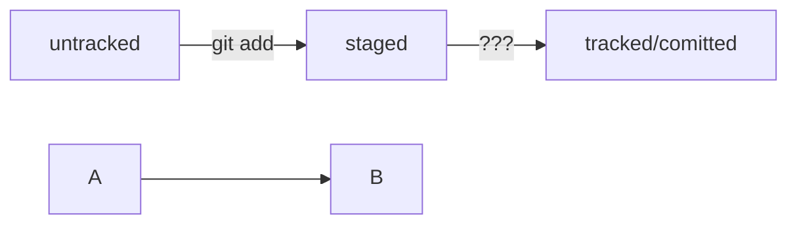

# Гайд для тебя, товарищ, погрузись со мной в Git
## Гайд создан на основе курса "Основы работы с Git" от Яндекс.Практикум
### Что такое Git? С чем его едят и нафига?
#### Git - это система контроля версий, которая помогает отслеживать изменения в проекте. Короче говоря, это инструмент, благодаря которому ты можешь сохранять свой проект на разных стадиях разработки и переключаться между этими версиями в любой момент, также позволяет пользоваться проектом удалённо <br>

Для работы с Git на Windows нужно установить Git for Windows с официального сайта. Основным инструментом будет консоль Git Bash.

### Основные команды Git Bash:
#### 
``` 
pwd (print working directory) - показать рабочую папку(нынешнюю)
ls (list directory contents) - показать файлы и папки в рабочей папке
ls -a () - показать все файлы и папки, даже скрытые
cd test(change directory) - перейти в папку test(только если она существует в рабочей папке иначе нужно указывать полный путь)
cd ~ - перейти в домашнюю директорию
cd .. - перейти на уровень выше(директорию, которой находится рабочая папка)
cd / - перейти в корневую директорию
touch file - создай файл file в текущей папке
mkdir name (make directory) - создай папку в текущей директории с именем name
cp file test2 (copy) - скопировать файл file в папку test2
mv file test2 (move) - переместить файл file в папку test2
cat file (concatenate and print) - распечатай содержимое файла file
rm file2 (remove) - удали файл file2
rmdir test3 (remove directory) - удали папку test3(только если папка пуста, иначе не сработает)
rm -r test3 - удали папку test3 со всем содержимым
```
### Основные команды Git:
####
```
git init - инициализация рабочей папки как репозитория Git

git remote add origin https://github.com/YandexPracticum/first-project.git - привяжи локальный репозиторий к удалённому с URL https://github.com/YandexPracticum/first-project.git;

git remote -v - проверь, что репозитории действительно связались;

git push -u origin main - в первый раз загрузи все коммиты из локального репозитория в удалённый с названием origin. main/master - зависит от названия ветки

git add file.txt - добавить в содержимое репозитория файл file.txt из рабочей папки, пометить его как файл, за которым нужно следить

git add --all (от англ. add, «добавить» + all, «всё») — подготовь к коммиту сразу все файлы, в которых были изменения, и все новые файлы;

git add . — подготовь к коммиту текущую папку и все файлы в ней.

git status - вывод информации о состоянии репозитория

git commit -m "Комментарий к коммиту." (от англ. commit, «совершать», фиксировать» + message, «сообщение») — сделай коммит и оставь комментарий, чтобы было проще понять, какие изменения сделаны;

git commit --amend --no-edit (от англ. amend, «исправить») — добавь изменения к последнему коммиту и оставь сообщение прежним;

git commit --amend -m "Новое сообщение" — измени сообщение к последнему коммиту на Новое сообщение.

git push - загрузить коммиты на Git

git log - получить историю коммитов репозитория

git log --oneline - получить сокращенный лог (первые несколько символов хеша каждого коммита и их комментарии)

git restore - откатить файл

git restore hello.txt — верни файл hello.txt к последней версии, которая была сохранена через git commit или git add;

git restore --staged hello.txt (от англ. restore, «восстановить») — переведи файл hello.txt из состояния staged обратно в untracked или modified;

git reset - откатить коммит

git reset --hard <commit hash> - откатиться к коммиту с <commit hash> с удалением последующих коммитов

git diff (от англ. difference, «отличие», «разница») — покажи изменения в «рабочей зоне», то есть в modified-файлах;

git diff a9928ab 11bada1 — выведи разницу между двумя коммитами;

git diff --staged — покажи изменения, которые добавлены в staged-файлах.

git clone git@github.com:YandexPraktikum/first-project.git (от англ. clone, «клон», «копия») — склонируй репозиторий с URL first-project.git из аккаунта YandexPraktikum на мой локальный компьютер.

git branch feature/the-finest-branch (от англ. branch, «ветка») — создай ветку от текущей с названием feature/the-finest-branch;

git checkout -b feature/the-finest-branch — создай ветку feature/the-finest-branch и сразу переключись на неё.

git branch (от англ. branch, «ветка») — покажи, какие есть ветки в репозитории и в какой из них я нахожусь (текущая ветка будет отмечена символом *);

git branch -a — покажи все известные ветки, как локальные (в локальном репозитории), так и удалённые (в origin, или на GitHub).

git checkout feature/br — переключись на ветку feature/br.

git diff main HEAD (от англ. difference, «отличие», «разница») — покажи разницу между веткой main и указателем на HEAD;

git diff HEAD~2 HEAD — покажи разницу между тем коммитом, который был два коммита назад, и текущим.

git branch -d br-name — удали ветку br-name, но только если она является частью main;

git branch -D br-name — удали ветку br-name, даже если она не объединена с main.

git merge main (от англ. merge, «сливать», «поглощать») — объедини ветку main с текущей активной веткой. 

git push -u origin my-branch (от англ. push, «толкнуть», «протолкнуть») — отправь новую ветку my-branch в удалённый репозиторий и свяжи локальную ветку с удалённой, чтобы при дополнительных коммитах можно было писать просто git push без -u;

git push my-branch — отправь дополнительные изменения в ветку my-branch, которая уже существует в удалённом репозитории;

git pull (от англ. pull, «вытянуть») — подтяни изменения текущей ветки из удалённого репозитория.

Интересный факт - первый коммит создателя Git был с таким коментарием - "the information manager from hell".
```
### Основные понятия Git:
####
```
HEAD - служебный файл папки .git, указывает на последний коммит(самый новый)
Если нужно передать последний коммит как параметр, то можно использовать слово HEAD
Состояния/статусы ф  йлов:
* untracked - неотслеживаемый файл. То есть Git его видит, но не следит за его изменениями, не учитывает при коммитах 
* tracked - отслеживаемый файл. Это: файлы, зафиксированные git commit, добавленные git add. Git следит за изменением этого файла
* staged/indexed/cached - после команды git add  файл попадает в staging area, то есть список файлов, которые войдут в коммит. git add - поставить на сцену персонажей, git commit - сделать снимок
* modified - изменённый. Git сравнил содержимое файла с последнеё сохранённой версией и нашёл отличия. Файл был закоммичен ранее, но в данный момент подвергся изменению
** Если файл staged/modified значит они уже оприори tracked

```
### Оформление коммитов в Git:
####
Корпоративный метод оформления - Jira. Например: коммит - "LGS-239: Дополнить список пасхалок новыми числами", LGS - название проекта, 239 - номер задачи в проекте.
Есть стандарт Conventional Commits - "соглашение о коммитах", качественная документация с подробной проработкой, подходит для исходного кода программ, но не очень для перевода книги. Например: "feat: добавить подсчёт суммы заказов за неделю"  - feat - новый функционал. Принцип стиля <type>: <сообщение> - type - тип изменений 
GitHub-стиль - "Исправить #334, добавить график температуры", #<номер задачи> - GitHub автоматически свяжет коммит с задачей из окна Issues
* На русском языке чаще используют инфинитивы, а в английском повелительное наклонение. Например "сделать, добавить, исправить" и "do, make, use, fix" 

### Работа с markdown. README.md файлом. Лицом репозитория
#### H4
Текст над чертой ("---")

---

Текст под чертой

Текст до переноса  
Текст после переноса <br> (Два пробела или "<br>" для переноса)
Текст после второго переноса

line(Два Enter для переноса на новый абзац с разделением пустой строкой)

another line

line
another line(А если нет переноса и Enter всего один, то строчки объединяются)

Выделение текста

Курсив - это *звездочки* или _подчеркивания_.

Полужирный шрифт - двойные **звездочки** или двойные __подчеркивания__.  
Можно совместить выделение **звездочки и _подчеркивания_**.  
Зачеркнутый текст - двойные ~~тильды~~.

Нумерованный список:  
1. Первый пункт нумерованного списка.  
2.   торой пункт.

Ненумерованный список:
* звездочкой с пробелом в начале строки  
- дефисом с пробелом в начале строки

Можно добавлять код в markdown с помощью тройных `.

```
mkdir my_project
cd my_project
git init
```

```html
<h1>А я просто текст</h1>
```

### Схема жизни файла в mermaid-схеме
####

```
%% - строка-комментарий 
``` 



##### H5

[Телеграмм](https://t.me/+POIefBtxyqYzYzAy)  
[ВК](https://vk.com/svvell "Адикондрий")
###### H6

### Хеширование. Навигация по коммитам
#### Git преобразует информацию о коммитах с помощью алгоритма SHA-1 и для каждого из них рассчитывает уникальный идентификатор — хеш.<br>
Хеш — основной идентификатор коммита и позволяет узнать его автора, дату и содержимое закоммиченных файлов.<br>
Все хеши, а также таблицу соответствий хеш информация о коммите Git хранит в папке .git. <br>
